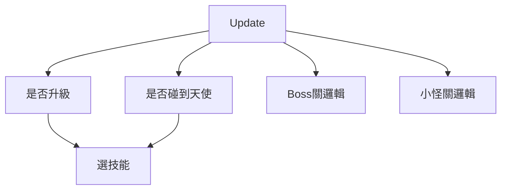
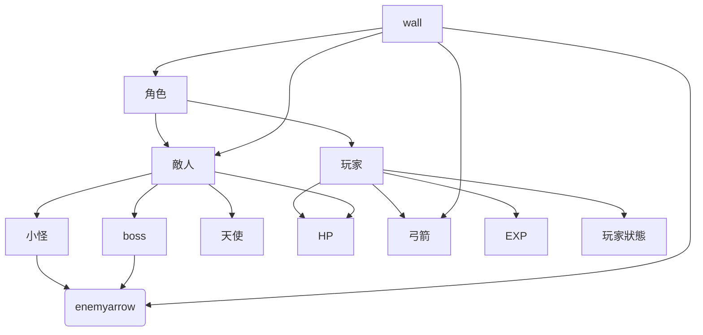

# 2025 OOPL Final Report

## 組別資訊

組別：P25
組員：杜詠霖
復刻遊戲：弓箭傳說

## 專案簡介

### 遊戲簡介
《弓箭傳說》是一款單手操作的Roguelite 動作遊戲。 世界即將被黑暗吞噬，作為弓箭手的你是最後希望，你將在無數個隨機生成的地牢中奮戰。 透過擊殺怪物後獲得的經驗值，升級手中武器，獲得千奇百怪的技能，並一步步朝最終關卡邁進。

### 組別分工
112820042 杜詠霖 100% 
## 遊戲介紹

### 遊戲規則
使用 W S A D 來控制上下左右，用滑鼠點擊技能。玩家必須避免被敵方碰觸及躲避子彈(一碰到就扣血)。每個地圖中有不同的障礙物阻擋玩家前進。 
(可按數字1、2增加攻擊、血量)
  
而玩家消滅敵人的方式則是射出弓箭。但，弓箭手(玩家)必須在原地時才能攻擊，移動時會因跑動而無法射擊。
  
當地圖上所有敵人被消滅後，玩家會獲取相應的經驗值。

### 遊戲畫面
1.遊玩畫面
2.升級後選擇技能
3.送禮物的天使
## 程式設計

### 程式架構

### 程式技術

1.**分開的update邏輯**
> - 將普通關卡與常常遇到特殊情況的王關，以及選擇技能介面三者分開，減少update時的負荷
> -  普通關卡主要處理小怪的生成、移動及攻擊行為。
> - 王關專注於 Boss 的特殊技能及行為模式。
> - 選擇技能介面獨立處理玩家升級後的技能選擇，避免與遊戲主邏輯混雜。

2. **物件導向設計**
> -  使用 `玩家` 和 `敵人` 作為基底類別，分別衍生出 `小怪`、`Boss` 和 `天使`。
> -  每個角色都擁有自己的 `HP` 和行為邏輯，並透過多型實現不同的攻擊方式。
> - 其中 `enemy`物件本身就已提供大量且基礎的參數以及方法，讓我們能夠輕鬆地創建敵人角色。這些參數包括敵人的生命值、攻擊力、移動速度等，而方法則涵蓋了敵人的行為，如攻擊、移動。 且能用std::vector來儲存敵人，方便用迴圈來處理所有敵人。 

3. **技能系統**
> - 為了技能系統 而參考其他人的程式碼並弄出的 button物件 能夠創造出按鈕且此物件能夠根據技能函式的不同而改變外觀和行為。 

4. **記憶體管理**
> - 使用 `std::shared_ptr`進行管理，其中弓箭及敵人子彈都是在射出時生成，並在不需要時釋放。

5. **錯誤日誌**
> - 透過 `log_my.hpp` 來記錄錯誤日誌，方便除錯和追蹤問題。其中錯誤資訊會存在 `log.txt` 檔案中，此舉能改善原本在終端機輸出錯誤訊息的方式，讓錯誤資訊更易於查閱。

## 結語

### 問題與解決方法
由於我以前寫程式主要以python為主，很少用C++，完成這個專案遇到過很多的問題www。 
 
一開始在創造`弓箭`的箭得時候使用的是*的指標，但這造成了我在沒有寫好解構元的情況下常常 Memory Leak。撐了一個月後才改成std::shared_ptr<>的方法才解決。
 

### 自評

| 項次 | 項目                   | 完成 |
|------|------------------------|-------|
| 1    | 完成協議書上所描述的最小關卡數量。  |  V  |
| 2    | 完成專案權限改為 public |  V  |
| 3    | 具有 debug mode 的功能  |  V  |
| 4    | 解決專案上所有 Memory Leak 的問題  |  V  |
| 5    | 報告中沒有任何錯字，以及沒有任何一項遺漏  |    |
| 6    | 報告至少保持基本的美感，人類可讀  |  V  |

### 心得

### 貢獻比例
我自己100%(沒有組員的孤兒www)