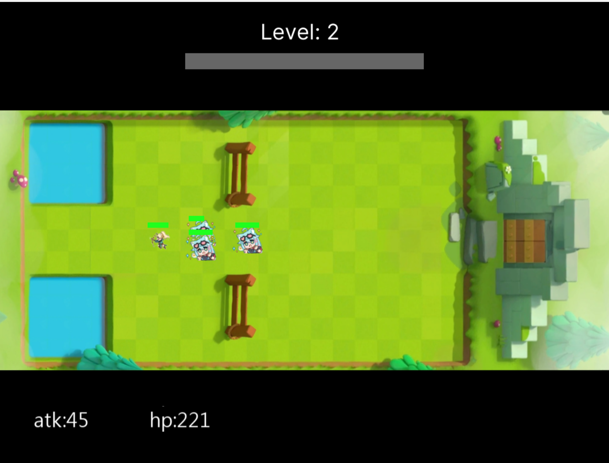
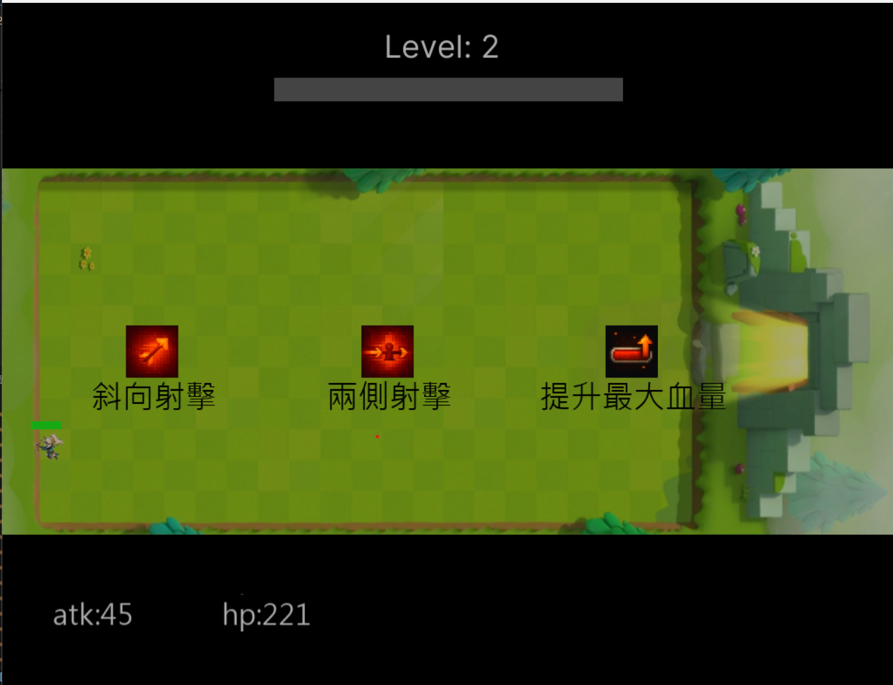
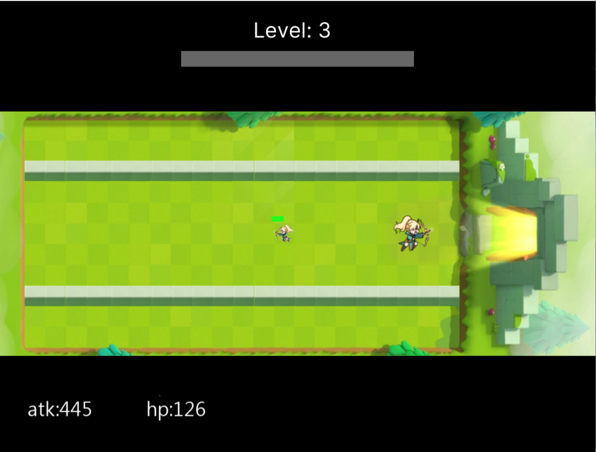
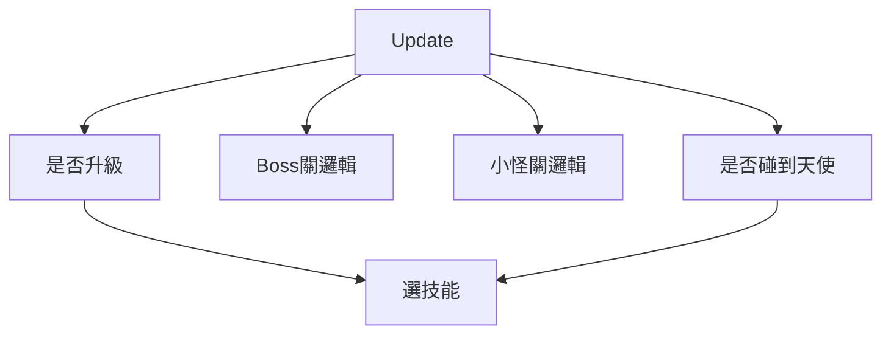
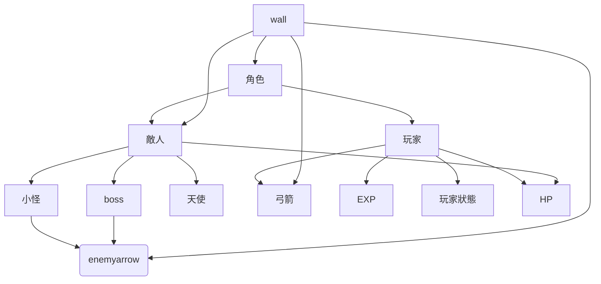

# 2025 OOPL Final Report

## 組別資訊

組別：P25
組員：杜詠霖
復刻遊戲：弓箭傳說

## 專案簡介

### 遊戲簡介
《弓箭傳說》是一款單手操作的Roguelite 動作遊戲。 世界即將被黑暗吞噬，作為弓箭手的你是最後希望，你將在無數個隨機生成的地牢中奮戰。 透過擊殺怪物後獲得的經驗值，升級手中武器，獲得千奇百怪的技能，並一步步朝最終關卡邁進。

### 組別分工
112820042 杜詠霖 100% 
## 遊戲介紹

### 遊戲規則
使用 W S A D 來控制上下左右，用滑鼠點擊技能。玩家必須避免被敵方碰觸及躲避子彈(一碰到就扣血)。每個地圖中有不同的障礙物阻擋玩家前進。
  
而玩家消滅敵人的方式則是射出弓箭。但，弓箭手(玩家)必須在原地時才能攻擊，移動時會因跑動而無法射擊。
  
當地圖上所有敵人被消滅後，玩家會獲取相應的經驗值。

### 遊戲畫面
1.遊玩畫面
2.升級後選擇技能
3.送禮物的天使
## 程式設計

### 程式架構

### 程式技術

## 結語

### 問題與解決方法
### 自評

| 項次 | 項目                   | 完成 |
|------|------------------------|-------|
| 1    | 這是範例 |  V  |
| 2    | 完成專案權限改為 public |  V  |
| 3    | 具有 debug mode 的功能  |    |
| 4    | 解決專案上所有 Memory Leak 的問題  |    |
| 5    | 報告中沒有任何錯字，以及沒有任何一項遺漏  |    |
| 6    | 報告至少保持基本的美感，人類可讀  |    |

### 心得
### 貢獻比例